# 🧠🧬 PanCancerSCAnalysis 🧠🧬

> **Polina Karitskaya**</br>
> tg: *@Polya_Karitskaya* </br>
> cinnamonness@gmail.com

> **Ivan Patskan**</br>
> tg: *@Rodamine* </br>
> patskanivan64@gmail.com

> **Valeria Stepanova**</br>
> tg: *@koko_lera* </br>
> ukrainskaya49@gmail.com

This project is a comprehensive analysis of single-cell RNA sequencing data from over 400 tumor and normal tissue samples, aimed at uncovering the transcriptional landscape of cancer. The study addresses a central question in cancer biology: whether key transcription factors are activated de novo following oncogenic transformation or whether their activity is inherited from the normal progenitor cells. While bulk RNA-seq studies have identified tumor type–specific regulators, their resolution is limited by the presence of non-cancerous cells in the tumor microenvironment.

By leveraging single-cell transcriptomic data, this project disentangles tumor-intrinsic signals from those of surrounding tissues. Through the comparison of cancer cells and their normal counterparts, we identify both conserved and cancer-specific transcriptional programs. The analysis highlights the extent to which tumors repurpose normal regulatory states, offering insights into the molecular basis of tumor identity and potential therapeutic targets.

**Supervisor**: Andrey Yurchenko, Institut Gustave Roussy, France

---

## Table of content

[Structure of repository](#Structure-of-repository)

[Introduction](#Introduction)

[Aims and objectives](#Aims-and-objectives)

[Data](#Data)

[Workflow](#Workflow)

[Results](#Results)

[Discussions](#Discussions)

[Project Setup Guide](#Project-Setup-Guide)

[Literature](#Literature)

## Structure of repository

1. `data`: contains derived pseudobulk datasets (gene × sample matrices) generated during analysis. 

⚠️ *Raw single-cell files (.h5ad)* are not included due to size constraints but can be downloaded from the original sources linked in this repository. 

2. `images`: contains pictures of our results.

3. `python_notebooks`: contains fully documented notebooks to reproduce all analyses.

4. `scripts`: contains R and Python scripts.

## Introduction

Cancer is a multifaceted disease characterized by substantial heterogeneity, shaped by somatic mutations, the tumor microenvironment, and the cell of origin. Previous studies employing bulk RNA sequencing have identified master transcriptional regulators that are specific to individual tumor types [2, 3]. However, because of cancer cells typically constitute only 30–70% of the bulk tumor mass, it is methodologically challenging to disentangle cancer cell-intrinsic transcriptional signals from those arising from the surrounding microenvironment.

A fundamental question in cancer biology is whether the activity of key transcription factors (TFs) is triggered post-oncogenic transformation or whether these factors are already active in the normal progenitor cells from which the tumors arise. Resolving this question is essential for elucidating the molecular mechanisms underlying carcinogenesis and for informing the development of targeted therapies. 

Therefore, the aim of this study was to perform a comprehensive analysis of single-cell RNA-seq data from over 400 tumor and normal tissue samples and compare transcriptional programmes between cancer cells and normal tissues of their origin to identify cancer-specific and common gene expression programmes.

## Aims and objectives

**Aim**: analyse scRNA-seq data from more than 400 samples of different types of cancer and normal tissues and compare transcriptional programmes between cancer cells and normal tissues of their origin to identify cancer-specific and common gene expression programmes 

**Objectives:**

1. Integrate the full dataset with different approaches (Harmony, BBKNN, Scanorama).

2. Annotate the normal cell types in the integrated dataset.

3. Developing an approach to identify the most likely tissue of origin for cancer types.

4. Analysis of TF activity in normal and cancer cells.

5. NMF-based analysis of gene signatures for cancer and normal cells.

## Data

The initial dataset consisted of single-cell RNA sequencing (scRNA-seq) data from over 400 tumor and normal tissue samples. To ensure robust downstream analysis, we filtered the dataset to retain only epithelial cells. Furthemore, we included only those samples that contained more than 100 total cells and at least 100 tumor cells. Samples from hematological cancers and sarcomas were excluded from further analysis because of the mesenchymal origin of these cancer types.

The original dataset used in this study is publicly available at [Zenodo](https://zenodo.org/records/10651059).

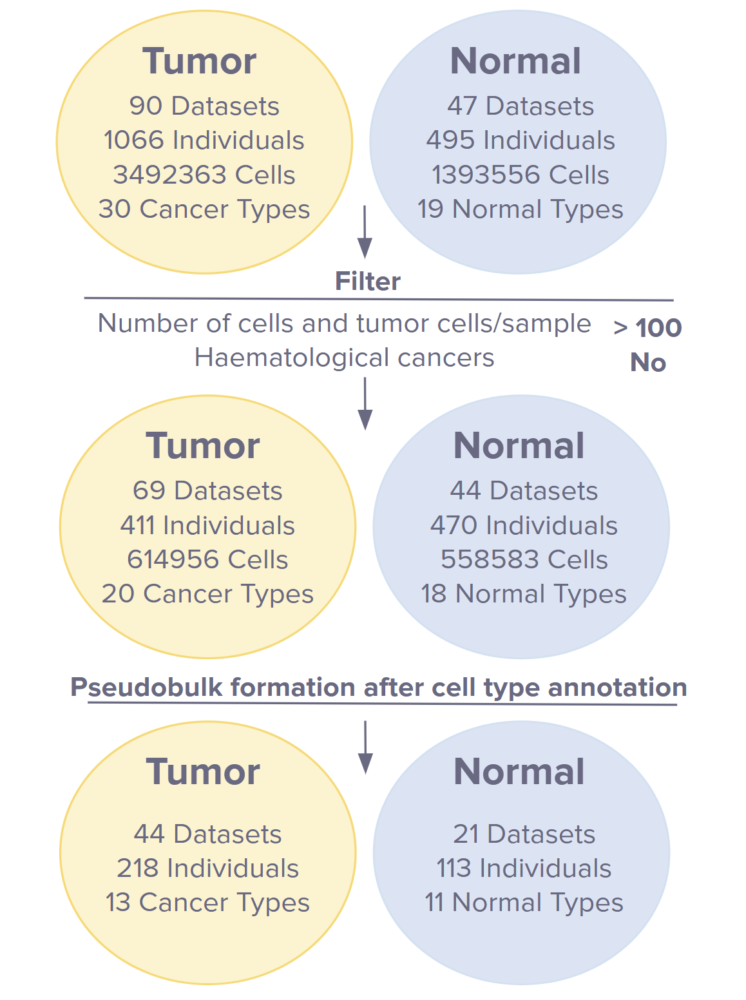

Due to the limited number of normal lung tissue samples and lung cancer subtypes in the primary dataset collection, we supplemented the initial compendium with a comprehensive lung tissue atlas comprising 20 annotated normal cell types,8 along with two additional scRNA-seq datasets encompassing multiple lung cancer subtypes. These newly incorporated datasets differed from the primary collection in both gene coverage and structural characteristics. As a result, we constructed a dedicated lung-specific dataset and conducted a parallel analysis, applying all integration and downstream analytical steps independently of the pan-cancer dataset.

The original dataset with lung tissue used in this study is publicly available at:  
- [Lung Cell Atlas (CZ CELLxGENE)](https://cellxgene.cziscience.com/collections/6f6d381a-7701-4781-935c-db10d30de293)  
- [Weizmann Institute 3CA Lung Atlas](https://www.weizmann.ac.il/sites/3CA/lung)  
- [GSE148071 (NCBI GEO)](https://www.ncbi.nlm.nih.gov/geo/query/acc.cgi?acc=GSE148071)  

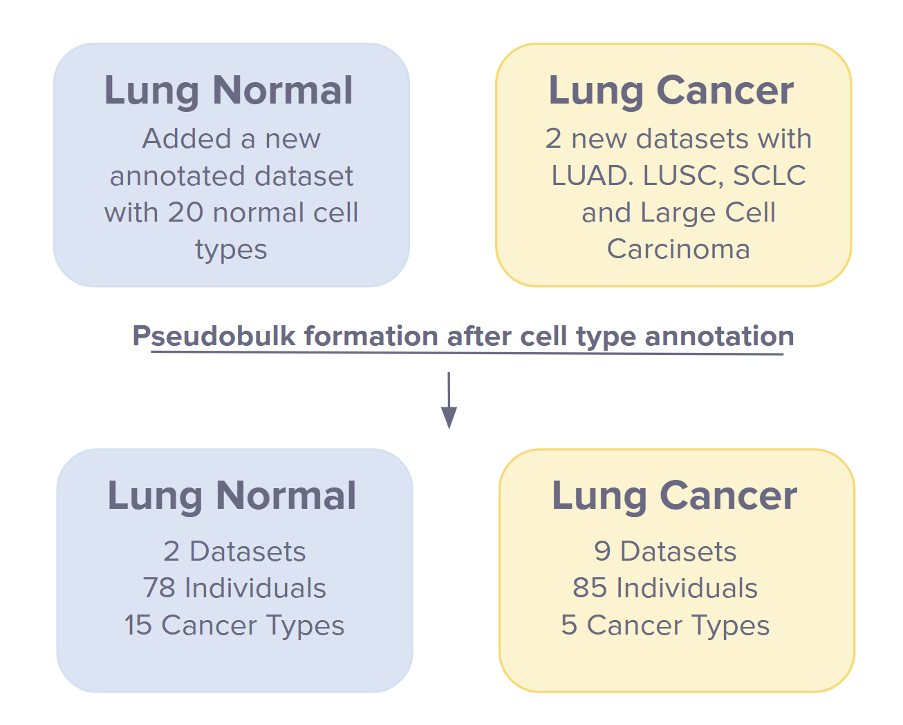

## Workflow

1. **Data integration**. We evaluated four widely used batch correction algorithms: Harmony, BBKNN (Batch Balanced K-Nearest Neighbors), fastMNN, and Scanorama. Among these, Scanorama demonstrated superior performance in terms of computational time and also mitigating batch effects while preserving biological variability, and was therefore used in all downstream analyses.

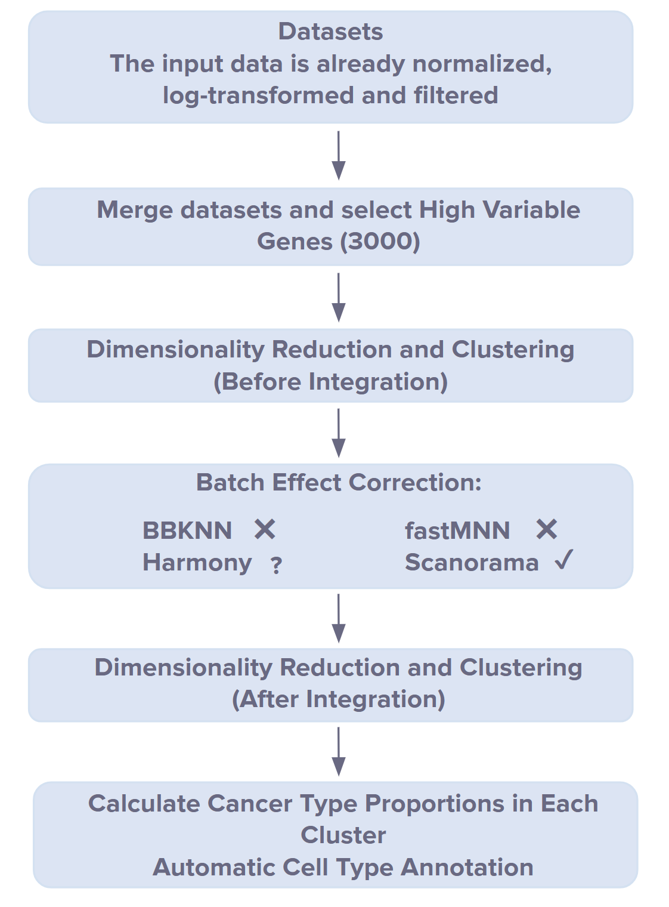

2. **Annotation the normal cell types in the integrated dataset**. We employed the CellTypist package, a machine learning-based tool designed for rapid and accurate cell type classification in single-cell transcriptomic data. We focused on 12 normal tissue types that corresponded to the most frequent tumor origins represented in our dataset. For tissues with available pre-trained models in the CellTypist repository, these models were directly applied for teach tissue separately. For tissues lacking suitable pre-trained models, we trained custom classifiers using reference datasets from publicly available normal tissue atlases to ensure accurate annotation.

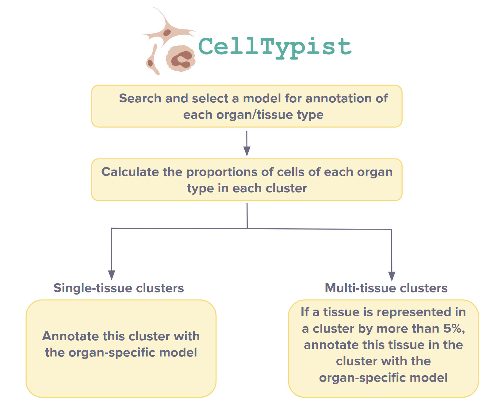

3. **Developing an approach to identify the most likely tissue of origin for cancer types**. We constructed pseudobulk expression profiles by aggregating single-cell data. Marker genes for each normal tissue type were identified using the Wilcoxon rank-sum test, selecting the top 100 genes with the highest tissue-specific expression. These marker sets were then used to compute single-sample Gene Set Enrichment Analysis (ssGSEA) scores [13, 14] for each tumor sample. The tissue type with the highest enrichment score was assigned as the predicted tissue of origin.

4. **Analysis of proliferative activity of tumor cells in comparison to their putative normal tissues of origin**. Pseudobulk expression profiles were generated for all analyzed cancer types and subtypes. From the pool of normal tissues, only those previously identified via ssGSEA as the most likely tissues of origin were retained. For each tumor–normal pair, ssGSEA was performed using a proliferation gene signature consisting of four markers: PCNA, TOP2A, MCM6, and MKI67. The input consisted of a full gene expression matrix. ssGSEA scores were normalized and averaged across replicates. To visualize differences in proliferative activity, we constructed a scatter plot displaying the mean normalized scores for each tumor–normal pair.
 
5. **Analysis of TF activity in normal and cancer cells**. We again used the pseudobulk dataset and extracted expression profiles of genes encoding transcription factors. The Wilcoxon rank-sum test was used to identify TFs with significantly different expression between cancer and corresponding normal tissues.

6. **NMF-based analysis of gene signatures for cancer and normal cells**. We applied Non-negative Matrix Factorization (NMF)-based decomposition to the cancer cell expression profiles. The optimal number of NMF components was determined using the *singlet* R package, which leverages multiple criteria including residual sum of squares and cophenetic correlation. Genes contributing most strongly to each component were subjected to Gene Ontology (GO) Biological Process enrichment analysis to assess their functional relevance.

## Results

Integration of scRNA-seq data using Scanorama effectively minimized batch effects while preserving biological heterogeneity, as evidenced by UMAP clustering.

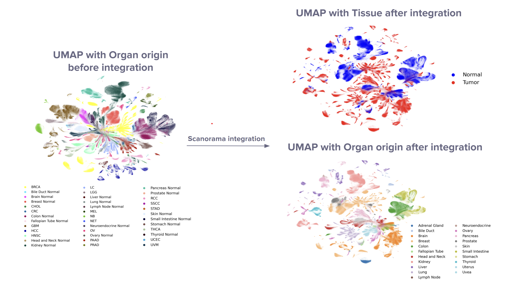

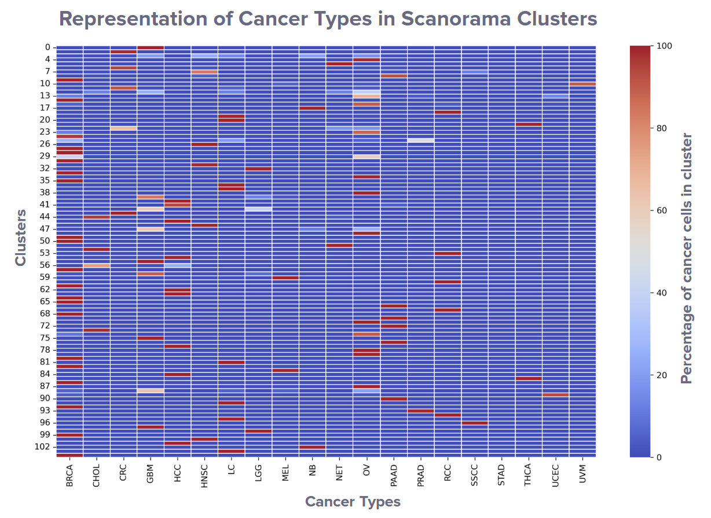

Also we used Harmony to integrate the Lung Dataset.

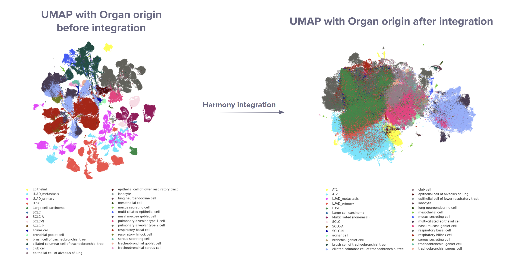

To infer the most probable cells of origin, we performed ssGSEA based on normal tissue-specific marker genes. This analysis identified 16 putative tissue-of-origin types across 12 cancer types. Breast cancer was stratified into three molecular subtypes - ER+, HER2+, and TNBC - while lung cancer was subdivided into LUAD, LUSC, and SCLC-A. For each cancer type or subtype, the tissue of origin was assigned based on the highest ssGSEA enrichment score corresponding to normal tissue profiles.

Here we present an example pictures of this analysis for PAAD and Pancreas.

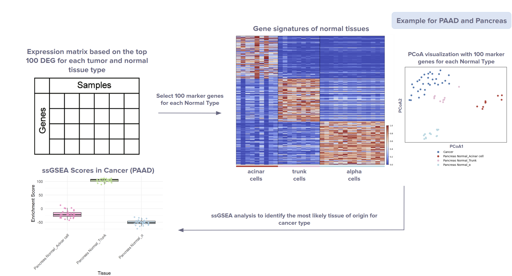

And we demonstate our results for Lung Cancer.

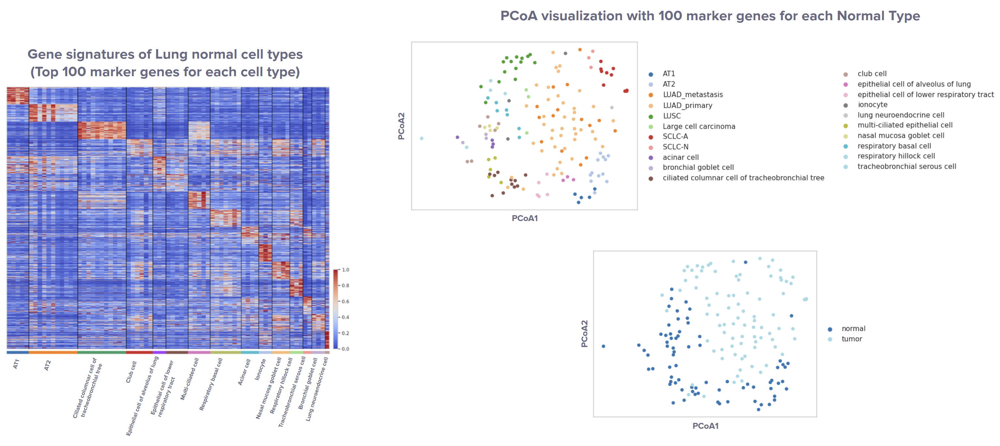

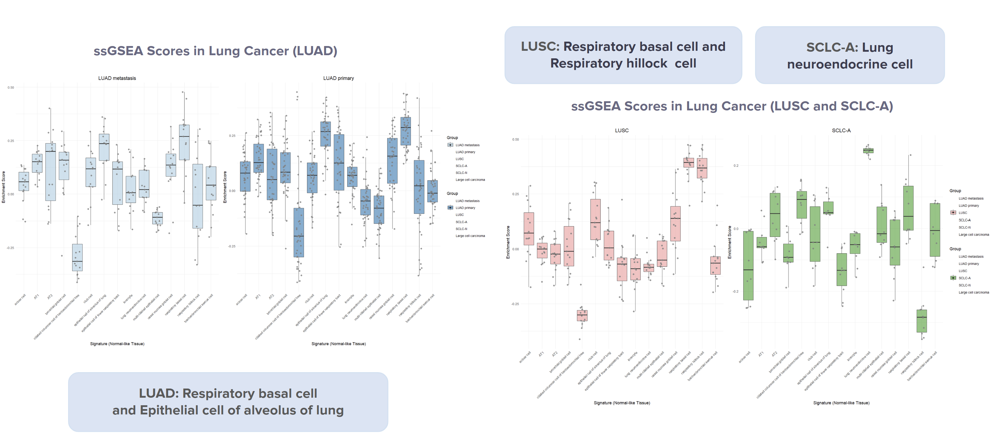

| Cancer Type | Normal Tissue               | Cell Type of Origin                          |
|-------------|-----------------------------|----------------------------------------------|
| MEL         | Melanocytes/Skin            | Melanocytes                                  |
| THCA        | Thyroid                     | Follicular cells                             |
| RCC         | Kidney                      | Kidney loop of Henle thin ascending epithelial cells |
| CHOL        | Bile duct                   | Cholangiocytes                               |
| UVM         | Melanocytes/eye             | Melanocytes                                  |
| CRC         | Colon                       | TA                                           |
| HCC         | Liver                       | Hepatocytes                                  |
| OV          | Fallopian Tube              | Secretory cells                              |
| HNSC        | Nasal                       | Respiratory basal cells                      |
| PAAD        | Pancreas                    | Trunk cells                                  |
| BRCA        | Breast                      | LummHR-major<br>Lumsec-basal                 |
| LUAD        | Lung                        | Respiratory basal cell<br>Epithelial cell of alveolus of lung |
| LUSC        | Lung                        | Respiratory basal cell<br>Respiratory hillock cell |
| SCLC-A      | Lung                        | Lung neuroendocrine cell                     |


Subsequently, to construct pseudobulk datasets for visualization and downstream analysis, we filtered the original dataset to retain only tumor samples and normal samples matching the inferred tissues of origin for each respective cancer type. UMAP visualization of pseudobulk profiles revealed partial co-localization of tumor and normal-origin samples, indicating that key transcriptional programs may be retained from the cell of origin.

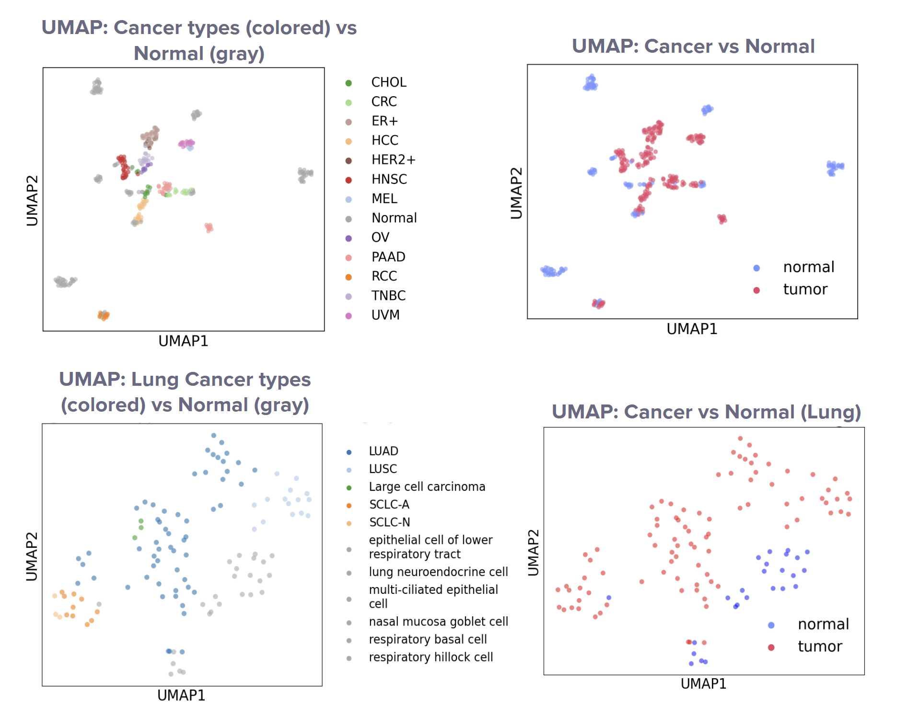

ssGSEA-based analysis of proliferative activity revealed that the majority of tumors exhibit elevated proliferation compared to their respective normal tissues of origin. In contrast, tumors derived from colorectal tissue and lung adenocarcinoma demonstrated proliferation levels comparable to those of normal counterparts, despite evident malignant transformation.

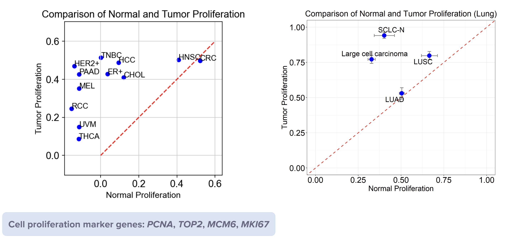

TF activity analysis identified two major regulatory patterns:
Tumor-specific TFs exhibited activity exclusively in cancer cells, suggesting de novo activation post-transformation.
Shared TFs were active in both tumors and corresponding normal tissues, implying that oncogenesis may exploit pre-existing regulatory frameworks inherent to progenitor cells.

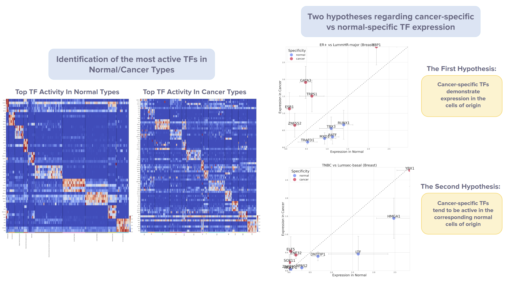

NMF analysis identified 12 transcriptional meta-programs across cancer and normal samples. Many were tissue-specific and shared between tumor cells and their normal counterparts, indicating that tumor transcriptomes often represent modulated versions of physiological programs. Gene Ontology enrichment analysis linked these meta-programs to core biological processes.

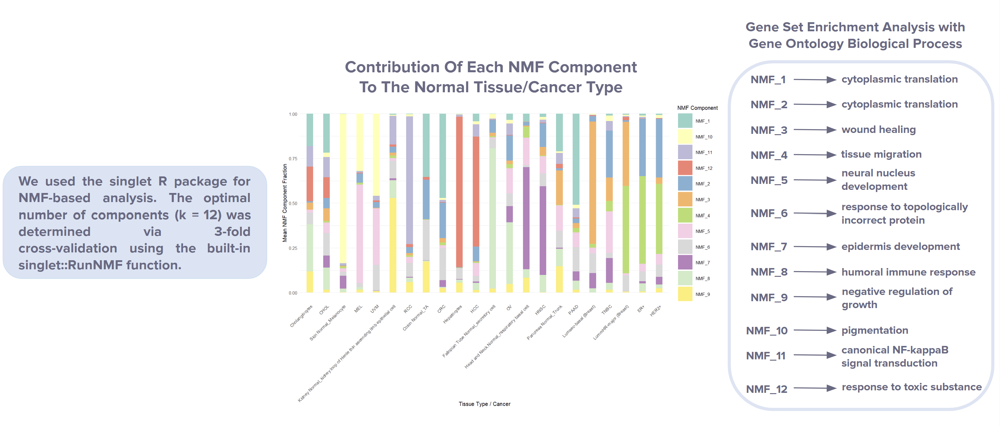

## Discussions

This study demonstrates that while some transcriptional programs in cancer are activated de novo, many are conserved from the tissue of origin. TF activity and meta-program analysis suggest that oncogenesis frequently co-opts normal regulatory states, rather than generating entirely novel ones. These findings emphasize the pivotal role of the cell of origin in shaping tumor identity and underscore the potential of targeting lineage-related vulnerabilities in cancer therapy.

## Project Setup Guide

This guide will help you clone the repository, set up a Python environment, install dependencies, and run the Jupyter notebooks.

1. **Clone the Repository**. First, clone the repository to your local machine using Git:

```bash
git clone git@github.com:Cinnamonness/PanCancerSCAnalysis.git
cd PanCancerSCAnalysis
```

2. **Set Up a Python Environment**. Create a Conda environment.

```bash
conda create -n myenv python=3.10
conda activate myenv
```

3. **Install Dependencies**. Install all required packages from requirements.txt.

```bash
pip install -r requirements.txt
```

If you plan to run Jupyter notebooks, also install:

```bash
pip install jupyterlab
```

4. **Launch Jupyter and Run Notebooks**. Start Jupyter Lab (or Notebook) from the project directory.

```bash
jupyter lab
```

## Literature

- Fan, J., Slowikowski, K., & Zhang, F. (2020). Single-cell transcriptomics in cancer: computational challenges and opportunities. Experimental &amp; Molecular Medicine, 52(9), 1452–1465. https://doi.org/10.1038/s12276-020-0422-0

- Reddy, J., Fonseca, M. A. S., Corona, R. I., Nameki, R., Segato Dezem, F., Klein, I. A., Chang, H., Chaves-Moreira, D., Afeyan, L. K., Malta, T. M., Lin, X., Abbasi, F., Font-Tello, A., Sabedot, T., Cejas, P., Rodríguez-Malavé, N., Seo, J.-H., Lin, D.-C., Matulonis, U., … Lawrenson, K. (2021). Predicting master transcription factors from pan-cancer expression data. Science Advances, 7(48). https://doi.org/10.1126/sciadv.abf6123

- Iglesia, M. D., Jayasinghe, R. G., Chen, S., Terekhanova, N. V., Herndon, J. M., Storrs, E., Karpova, A., Zhou, D. C., Al Deen, N. N., Shinkle, A. T., Lu, R. J.-H., Caravan, W., Houston, A., Zhao, Y., Sato, K., Lal, P., Street, C., Rodrigues, F. M., Southard-Smith, A. N., … Ding, L. (2023). Differential chromatin accessibility and transcriptional dynamics define breast cancer subtypes and their lineages. Cold Spring Harbor Laboratory. https://doi.org/10.1101/2023.10.31.565031

- Kang, J., Lee, J. H., Cha, H., An, J., Kwon, J., Lee, S., Kim, S., Baykan, M. Y., Kim, S. Y., An, D., Kwon, A.-Y., An, H. J., Lee, S.-H., Choi, J. K., & Park, J.-E. (2024). Systematic dissection of tumor-normal single-cell ecosystems across a thousand tumors of 30 cancer types. Nature Communications, 15(1). https://doi.org/10.1038/s41467-024-48310-4

- Sikkema, L., Ramírez-Suástegui, C., Strobl, D. C., Gillett, T. E., Zappia, L., Madissoon, E., Markov, N. S., Zaragosi, L.-E., Ji, Y., Ansari, M., Arguel, M.-J., Apperloo, L., Banchero, M., Bécavin, C., Berg, M., Chichelnitskiy, E., Chung, M., Collin, A., Gay, A. C. A., … Theis, F. J. (2023). An integrated cell atlas of the lung in health and disease. Nature Medicine, 29(6), 1563–1577. https://doi.org/10.1038/s41591-023-02327-2

- Chan, J. M., Quintanal-Villalonga, Á., Gao, V. R., Xie, Y., Allaj, V., Chaudhary, O., Masilionis, I., Egger, J., Chow, A., Walle, T., Mattar, M., Yarlagadda, D. V. K., Wang, J. L., Uddin, F., Offin, M., Ciampricotti, M., Qeriqi, B., Bahr, A., de Stanchina, E., … Rudin, C. M. (2021). Signatures of plasticity, metastasis, and immunosuppression in an atlas of human small cell lung cancer. Cancer Cell, 39(11), 1479-1496.e18. https://doi.org/10.1016/j.ccell.2021.09.008

- Fan, J., Chen, Y., Gong, Y., Sun, H., Hou, R., Dou, X., Zhang, Y., & Huo, C. (2025). Single-cell RNA sequencing reveals potential therapeutic targets in the tumor microenvironment of lung squamous cell carcinoma. Scientific Reports, 15(1). https://doi.org/10.1038/s41598-025-93916-3

- Korsunsky, I., Millard, N., Fan, J., Slowikowski, K., Zhang, F., Wei, K., Baglaenko, Y., Brenner, M., Loh, P., & Raychaudhuri, S. (2019). Fast, sensitive and accurate integration of single-cell data with Harmony. Nature Methods, 16(12), 1289–1296. https://doi.org/10.1038/s41592-019-0619-0

- Polański, K., Young, M. D., Miao, Z., Meyer, K. B., Teichmann, S. A., & Park, J.-E. (2019). BBKNN: fast batch alignment of single cell transcriptomes. Bioinformatics, 36(3), 964–965. https://doi.org/10.1093/bioinformatics/btz625

- Haghverdi, L., Lun, A. T. L., Morgan, M. D., & Marioni, J. C. (2018). Batch effects in single-cell RNA-sequencing data are corrected by matching mutual nearest neighbors. Nature Biotechnology, 36(5), 421–427. https://doi.org/10.1038/nbt.4091

- Hie, B., Bryson, B., & Berger, B. (2019). Efficient integration of heterogeneous single-cell transcriptomes using Scanorama. Nature Biotechnology, 37(6), 685–691. https://doi.org/10.1038/s41587-019-0113-3

- Xu, C., Prete, M., Webb, S., Jardine, L., Stewart, B. J., Hoo, R., He, P., Meyer, K. B., & Teichmann, S. A. (2023). Automatic cell-type harmonization and integration across Human Cell Atlas datasets. Cell, 186(26), 5876-5891.e20. https://doi.org/10.1016/j.cell.2023.11.026

- Subramanian, A., Tamayo, P., Mootha, V. K., Mukherjee, S., Ebert, B. L., Gillette, M. A., Paulovich, A., Pomeroy, S. L., Golub, T. R., Lander, E. S., & Mesirov, J. P. (2005). Gene set enrichment analysis: A knowledge-based approach for interpreting genome-wide expression profiles. Proceedings of the National Academy of Sciences, 102(43), 15545–15550. https://doi.org/10.1073/pnas.0506580102

- Barbie, D. A., Tamayo, P., Boehm, J. S., Kim, S. Y., Moody, S. E., Dunn, I. F., Schinzel, A. C., Sandy, P., Meylan, E., Scholl, C., Fröhling, S., Chan, E. M., Sos, M. L., Michel, K., Mermel, C., Silver, S. J., Weir, B. A., Reiling, J. H., Sheng, Q., … Hahn, W. C. (2009). Systematic RNA interference reveals that oncogenic KRAS-driven cancers require TBK1. Nature, 462(7269), 108–112. https://doi.org/10.1038/nature08460

- Barkley, D., Moncada, R., Pour, M., Liberman, D. A., Dryg, I., Werba, G., Wang, W., Baron, M., Rao, A., Xia, B., França, G. S., Weil, A., Delair, D. F., Hajdu, C., Lund, A. W., Osman, I., & Yanai, I. (2022). Cancer cell states recur across tumor types and form specific interactions with the tumor microenvironment. Nature Genetics, 54(8), 1192–1201. https://doi.org/10.1038/s41588-022-01141-9

- Gavish, A., Tyler, M., Greenwald, A. C., Hoefflin, R., Simkin, D., Tschernichovsky, R., Galili Darnell, N., Somech, E., Barbolin, C., Antman, T., Kovarsky, D., Barrett, T., Gonzalez Castro, L. N., Halder, D., Chanoch-Myers, R., Laffy, J., Mints, M., Wider, A., Tal, R., … Tirosh, I. (2023). Hallmarks of transcriptional intratumour heterogeneity across a thousand tumours. Nature, 618(7965), 598–606. https://doi.org/10.1038/s41586-023-06130-4

- DeBruine, Z. (2021). singlet: Single-cell analysis with non-negative matrix factorization (Version 0.0.99) [R package]. GitHub. https://github.com/zdebruine/singlet


